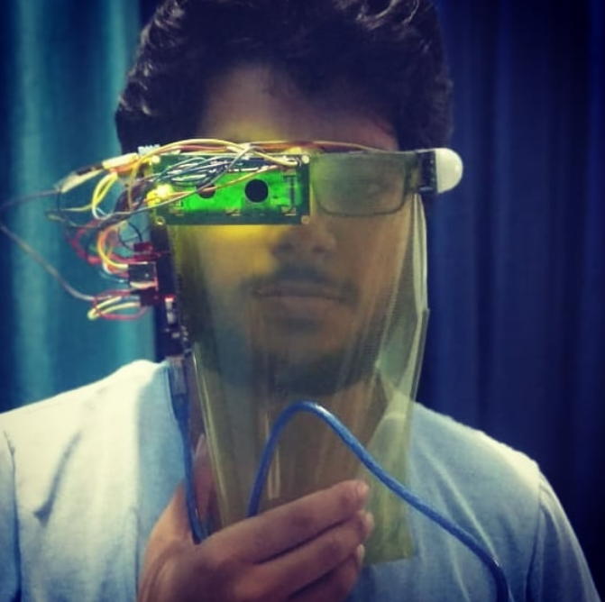

# Covid-Sarthi
A smart Face Shield  to Prevent Covid 19, Don't forget to wear mask
## Components
1. Ardunio Uno
2. LCD 16*2 or __any display device__
3. DHT11 or LM35 (Human Body Temp. measurement prototype)
4. Proximity or PIR sensor (To Maintain Social Distance)
5. Buzzer or Led
6. Resistors, Wires etc
7. Face Shield and googles for placement of circuit
8. Power device like Power Bank for Arduino 
> Adjust code based on your components, raise issue if help needed (A little googling will do though)
> Suggest changes in code via PR

## PROTOTYPE- COVID Sarthi

## SCHEMATICS

## Feature Extension
1. Adding more Body param sensors like B.P., Heart rate etc
2. Collectig data in db
3. Using thinner display, preferabely embedded in glasses
4. Smart Mask Extension
5. Using Rpi instead of arduino, to introduce features like Google Assistant in the display itself, with a speaker and earphone
